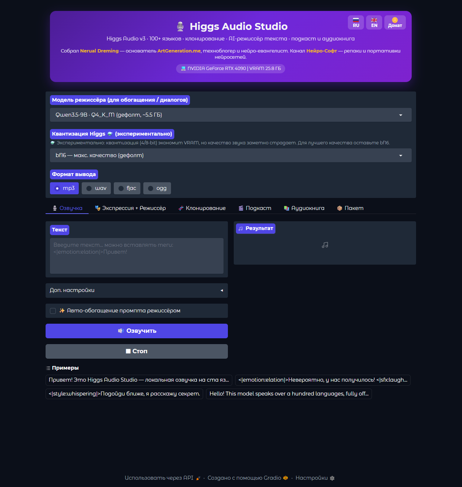
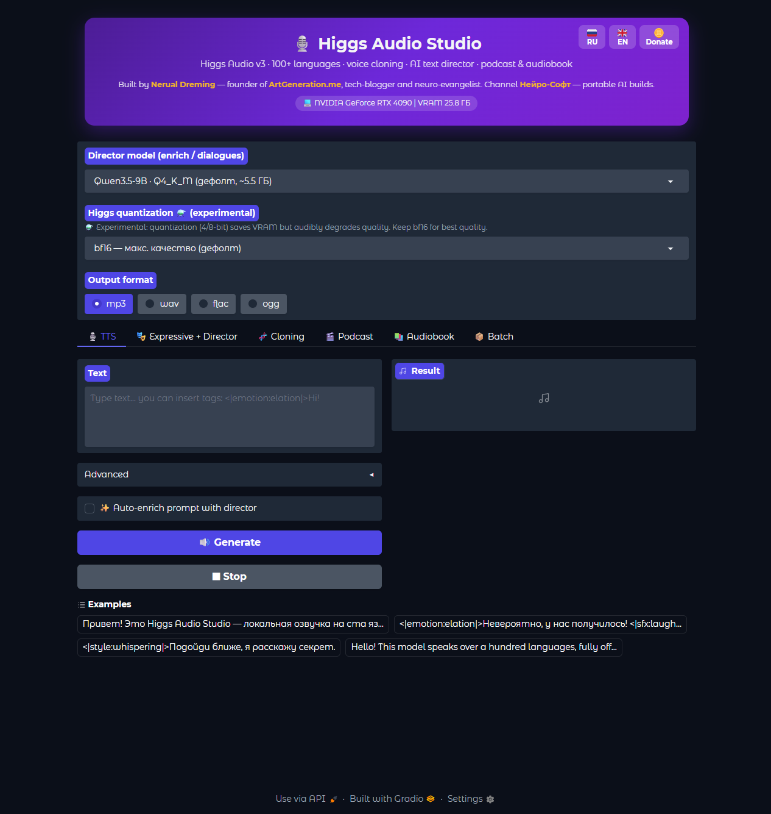

# 🎙️ Higgs Audio Studio

**Портативная локальная озвучка на базе [Higgs Audio v3 TTS](https://huggingface.co/bosonai/higgs-audio-v3-tts-4b) — экспрессивная речь на 100+ языках (русский в топ-тире), zero-shot клонирование голоса, AI-режиссёр текста, режимы Подкаст и Аудиокнига. 100% оффлайн.**

 

> 🚀 **Установка в один клик через [Pinokio](https://pinokio.co) (кроссплатформенно):**
> 
> 
>
> Работает на **Windows / Linux (x64 & aarch64) / macOS** · NVIDIA / AMD / Apple Silicon / CPU. Без `install.bat` — Pinokio сам ставит CUDA, Python 3.12, PyTorch и зависимости. Лаунчер: **[timoncool/HiggsAudio-Studio-pinokio](https://github.com/timoncool/HiggsAudio-Studio-pinokio)**

Всё живёт внутри папки: Python, зависимости, модели, кэш. Ничего не ставится в систему. Удалил папку — удалил приложение.

## Возможности

- **🎙️ Озвучка** — текст → речь, 100+ языков; температура, top-p/k, seed с замком; автоплей; кнопка **⏹ Стоп** обрывает генерацию на лету (на уровне инференса); прогресс по кадрам прямо в терминале.
- **🎭 Экспрессия + 🤖 Режиссёр** — вставка управляющих тегов (`<|emotion|>`, `<|sfx|>`, `<|prosody|>`, `<|style|>`) кнопками + кнопка **«Обогатить»**: лёгкая локальная LLM нормализует текст и расставляет эмоциональные/звуковые/просодические теги по смыслу.
- **🧬 Клонирование** — голос по референсу (zero-shot) с авто-транскриптом (Moonshine ASR); библиотека пресетов + докачка русского пака.
- **🎬 Подкаст / Диалог** — LLM пишет мульти-спикерный сценарий, каждому спикеру свой голос и манера → склейка с **автовыравниванием громкости спикеров** (LUFS −16, стандарт подкастов — один диктор не тише другого).
- **📚 Аудиокнига** — атрибуция «рассказчик/персонажи» в готовом тексте с постоянным ростером (тот же герой = тот же голос), длинная форма с переносом тембра + нормализация громкости.
- **📦 Пакет** — список текстов → массовая озвучка с лайв-логом.
- **💾 Формат вывода** — WAV / MP3 / FLAC / OGG на выбор; результаты сохраняются в `output/` с таймстампами.

**43 управляющих тега:** 21 эмоция, 10 просодия, 3 стиля, 9 звуков. **AI-режиссёр** — переключаемая модель: Qwen3.5-9B (по умолчанию) / Gemma-3-12B / Qwen3.5-4B, квантизация на лету (⚗️ экспериментально), авто по VRAM. Интерфейс **RU / EN**.

## Системные требования

### Платформы (через Pinokio-лаунчер)

| ОС | GPU | Статус | Ускорение |
|---|---|---|---|
| Windows 10/11 | NVIDIA RTX 30xx–50xx | ✅ протестировано | CUDA 12.8 + Triton (torch.compile ~2×) |
| Windows 10/11 | NVIDIA RTX 20xx | ✅ ожидается | CUDA 12.8 + Triton |
| Linux x64 | NVIDIA RTX 20xx–50xx | ✅ ожидается | CUDA 12.8 + Triton |
| Linux aarch64 | NVIDIA DGX Spark / Jetson | ✅ ожидается | CUDA 13.0 |
| Windows | AMD RDNA3+ | ✅ ожидается | DirectML |
| Linux | AMD RDNA3+ | ✅ ожидается | ROCm 6.3 |
| macOS | Apple Silicon M1–M4 | ✅ ожидается | MPS |
| macOS | Intel | ⚠️ только CPU | torch CPU |
| Любая | Только CPU | ⚠️ очень медленно | CPU |

> Higgs не использует Flash-Attention 2 (берёт SDPA с flash-ядрами). Локальная `install.bat`-сборка — NVIDIA Windows; полная кроссплатформенность — через [Pinokio](https://github.com/timoncool/HiggsAudio-Studio-pinokio).

### Память (NVIDIA; TTS квантуется на лету, LLM-режиссёр грузится отдельно)

| VRAM | Режим TTS | LLM-режиссёр |
|------|-----------|--------------|
| 24 GB+ | bf16 (~11 ГБ) | 9–12B в 4-бит (~6–8 ГБ) |
| 12 GB | 8-бит (~6–7 ГБ) | 4–9B в 4-бит (~3–6 ГБ) |
| 6–8 GB | 4-бит (~3.5 ГБ) | 2–4B в 4-бит (~1.5–3 ГБ) |
| CPU | работает, очень медленно | — |

Модели (~9 ГБ TTS + LLM) скачиваются автоматически при первом запуске.

## Установка

1. Скачайте репозиторий (или релизный архив).
2. Запустите **`install.bat`** — выберите GPU (CUDA 11.8 / 12.6 / 12.8 или CPU). Поставит портативный Python, PyTorch и зависимости.
3. Запустите **`run.bat`** — приложение откроется в браузере. При первом запуске скачаются модели.
4. Обновление — **`update.bat`**.

## Лицензия

Код обёртки — открытый. **Веса Higgs Audio v3 распространяются Boson AI под лицензией Research & Non-Commercial** — приложение некоммерческое. Клонирование голоса — только с согласия владельца голоса; запрещены выдача себя за другого, мошенничество и любое незаконное использование. См. [карточку модели](https://huggingface.co/bosonai/higgs-audio-v3-tts-4b).

## Другие портативные нейросети

| Проект | Описание |
|--------|----------|
| [VoxCPM2](https://github.com/timoncool/VoxCPM2_portable) | Мультиязычный TTS + Voice Design + LoRA-файнтюн |
| [ACE-Step Studio](https://github.com/timoncool/ACE-Step-Studio) | Генерация музыки: песни с вокалом, каверы, клипы |
| [Foundation Music Lab](https://github.com/timoncool/Foundation-Music-Lab) | Музыка + таймлайн-редактор (Stable Audio) |
| [Qwen3-TTS](https://github.com/timoncool/Qwen3-TTS_portable_rus) | Синтез речи с клонированием (Qwen3) |
| [SuperCaption Qwen3-VL](https://github.com/timoncool/SuperCaption_Qwen3-VL) | Описание изображений (Qwen3-VL) |
| [LavaSR](https://github.com/timoncool/LavaSR_portable_ru) | Улучшение качества аудио (super-resolution) |
| [VibeVoice ASR](https://github.com/timoncool/VibeVoice_ASR_portable_ru) | Распознавание речи (ASR) |
| [VideoSOS](https://github.com/timoncool/videosos) | AI-видеопродакшн в браузере |

## Авторы

- **Nerual Dreming** ([t.me/nerual_dreming](https://t.me/nerual_dreming)) — [neuro-cartel.com](https://neuro-cartel.com) | основатель [ArtGeneration.me](https://artgeneration.me)
- **Нейро-Софт** ([t.me/neuroport](https://t.me/neuroport)) — репаки и портативки нейросетей

---

> **Если проект полезен — поставьте звёздочку!** Это помогает другим находить проект.

## Star History

<a href="https://www.star-history.com/?repos=timoncool%2FHiggsAudio-Studio&type=date&legend=top-left">
 <picture>
   <source media="(prefers-color-scheme: dark)" srcset="https://api.star-history.com/image?repos=timoncool/HiggsAudio-Studio&type=date&theme=dark&legend=top-left" />
   <source media="(prefers-color-scheme: light)" srcset="https://api.star-history.com/image?repos=timoncool/HiggsAudio-Studio&type=date&legend=top-left" />
   
 </picture>
</a>
