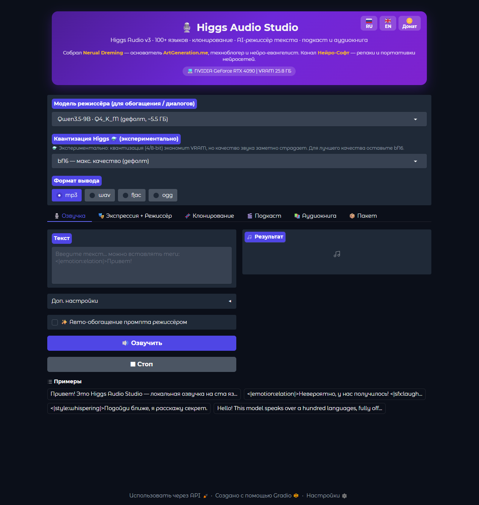
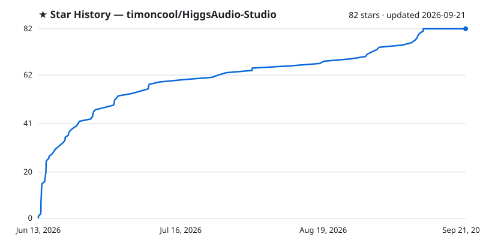

# Higgs Audio Studio

**Портативная локальная озвучка на базе Higgs Audio v3 TTS — экспрессивная речь на 100+ языках, zero-shot клонирование голоса, AI-режиссёр текста, режимы Подкаст и Аудиокнига. 100% оффлайн, в один клик.**

**[English](README.md)** · **[Русский](README_RU.md)**

> 🚀 **Кроссплатформенная установка в один клик через [Pinokio](https://pinokio.co):**
> 
> 
>
> Работает на **Windows / Linux (x64 & aarch64) / macOS** · NVIDIA / AMD / Apple Silicon / CPU. Без `install.bat` — Pinokio сам ставит CUDA, Python 3.12, PyTorch и зависимости. Лаунчер: **[timoncool/HiggsAudio-Studio-pinokio](https://github.com/timoncool/HiggsAudio-Studio-pinokio)**

Экспрессивная речь на 100+ языках, клонирование любого голоса по референсу, локальный LLM-режиссёр подачи и готовые **подкасты** и **аудиокниги** — целиком на твоей машине. **100% оффлайн**, без облака и API-ключей. Всё живёт внутри папки: Python, зависимости, модели, кэш. Удалил папку — удалил приложение.

Основано на [Higgs Audio v3 TTS](https://huggingface.co/bosonai/higgs-audio-v3-tts-4b) от Boson AI — экспрессивная TTS-модель на 4B с нативным мультиспикером и инлайн-управлением эмоциями/просодией.

## Возможности

- **🎙️ Озвучка** — текст → речь, 100+ языков; температура, top-p/k, seed с замком; автоплей; кнопка **⏹ Стоп** обрывает генерацию на лету (на уровне инференса); прогресс по кадрам в терминале.
- **🎭 Экспрессия + 🤖 Режиссёр** — вставка управляющих тегов (`<|emotion|>`, `<|sfx|>`, `<|prosody|>`, `<|style|>`) кнопками + кнопка **«Обогатить»**: лёгкая локальная LLM нормализует текст и расставляет эмоциональные/звуковые/просодические теги по смыслу.
- **🧬 Клонирование** — голос по референсу (zero-shot) с авто-транскриптом (Moonshine ASR); библиотека пресетов + докачка русского пака.
- **🎬 Подкаст / Диалог** — LLM пишет мульти-спикерный сценарий, каждому спикеру свой голос → склейка с **выравниванием громкости спикеров** (LUFS −16, стандарт подкастов — один диктор не тише другого).
- **📚 Аудиокнига** — атрибуция «рассказчик/персонажи» с постоянным ростером (тот же герой = тот же голос), длинная форма с переносом тембра + нормализация громкости.
- **📦 Пакет** — список текстов → массовая озвучка с лайв-логом.
- **💾 Формат вывода** — WAV / MP3 / FLAC / OGG на выбор; результаты в `output/` с таймстампами.

**43 управляющих тега:** 21 эмоция, 10 просодия, 3 стиля, 9 звуков. **AI-режиссёр** — переключаемая GGUF-модель: Qwen3.5-9B (по умолчанию, ~5.5 ГБ) / Qwen3.5-4B (лёгкая, ~2.5 ГБ), работает на GPU через llama.cpp. Квантизация Higgs TTS — на лету (⚗️ экспериментально), авто по VRAM. Интерфейс **RU / EN**.

## Системные требования

### Платформы (через Pinokio-лаунчер)

| ОС | GPU | Статус | Ускорение |
|---|---|---|---|
| Windows 10/11 | NVIDIA RTX 30xx–50xx | ✅ протестировано | CUDA 12.8 + Triton (torch.compile ~2×) |
| Windows 10/11 | NVIDIA RTX 20xx | ✅ ожидается | CUDA 12.8 + Triton |
| Linux x64 | NVIDIA RTX 20xx–50xx | ✅ ожидается | CUDA 12.8 + Triton |
| Linux aarch64 | NVIDIA DGX Spark / Jetson | ✅ ожидается | CUDA 13.0 |
| Windows | AMD RDNA3+ | ✅ ожидается | DirectML |
| Linux | AMD RDNA3+ | ✅ ожидается | ROCm 6.3 |
| macOS | Apple Silicon M1–M4 | ✅ ожидается | MPS |
| macOS | Intel | ⚠️ только CPU | torch CPU |
| Любая | Только CPU | ⚠️ очень медленно | CPU |

> Higgs не использует Flash-Attention 2 (берёт SDPA с flash-ядрами). Локальная `install.bat`-сборка — NVIDIA Windows; полная кроссплатформенность — через [Pinokio](https://github.com/timoncool/HiggsAudio-Studio-pinokio).

### Память (NVIDIA; TTS квантуется на лету, LLM-режиссёр грузится отдельно)

| VRAM | Режим TTS | LLM-режиссёр |
|------|-----------|--------------|
| 24 GB+ | bf16 (~11 ГБ) | 9–12B в 4-бит (~6–8 ГБ) |
| 12 GB | 8-бит (~6–7 ГБ) | 4–9B в 4-бит (~3–6 ГБ) |
| 6–8 GB | 4-бит (~3.5 ГБ) | 2–4B в 4-бит (~1.5–3 ГБ) |
| CPU | работает, очень медленно | — |

Модели (~9 ГБ TTS + LLM) скачиваются автоматически при первом запуске.

## Быстрый старт

1. **Скачайте** репозиторий.
2. **Установка** — запустите **`install.bat`**, выберите GPU (CUDA 11.8 / 12.6 / 12.8 или CPU). Поставит портативный Python, PyTorch и зависимости.
3. **Запуск** — запустите **`run.bat`**; приложение откроется в браузере, модели скачаются при первом запуске. Обновление — **`update.bat`**.

Или в один клик кроссплатформенно через [Pinokio](https://pinokio.co/item?uri=https://github.com/timoncool/HiggsAudio-Studio-pinokio) — без `install.bat`.

## Другие проекты [@timoncool](https://github.com/timoncool)

| Проект | Описание |
|--------|----------|
| [VoxCPM2 Portable](https://github.com/timoncool/VoxCPM2_portable) | Мультиязычный TTS + Voice Design + LoRA-файнтюн |
| [Qwen3-TTS](https://github.com/timoncool/Qwen3-TTS_portable_rus) | Портативный TTS с клонированием голоса |
| [ACE-Step Studio](https://github.com/timoncool/ACE-Step-Studio) | AI-студия музыки — песни, вокал, каверы, клипы |
| [Foundation Music Lab](https://github.com/timoncool/Foundation-Music-Lab) | Генерация музыки + редактор таймлайна |
| [VibeVoice ASR](https://github.com/timoncool/VibeVoice_ASR_portable_ru) | Портативное распознавание речи |
| [LavaSR](https://github.com/timoncool/LavaSR_portable_ru) | Портативное улучшение аудио |
| [SuperCaption Qwen3-VL](https://github.com/timoncool/SuperCaption_Qwen3-VL) | Портативное описание изображений |
| [VideoSOS](https://github.com/timoncool/videosos) | AI-видеопродакшн в браузере |

## Авторы

- **Nerual Dreming** — [Telegram](https://t.me/nerual_dreming) | [neuro-cartel.com](https://neuro-cartel.com) | [ArtGeneration.me](https://artgeneration.me)
- **Нейро-Софт** — [Telegram](https://t.me/neuroport) | портативные нейросети

## Благодарности

- **[Boson AI — Higgs Audio v3](https://huggingface.co/bosonai/higgs-audio-v3-tts-4b)** — модель TTS
- **[multimodalart](https://huggingface.co/multimodalart/higgs-audio-v3-tts-4b-transformers)** — transformers-порт модели
- **[Slait/russia_voices](https://huggingface.co/datasets/Slait/russia_voices)** — 743 русских голоса-пресета
- **[Moonshine ASR](https://github.com/usefulsensors/moonshine)** — авто-транскрипт референса
- **[pyloudnorm](https://github.com/csteinmetz1/pyloudnorm)** — выравнивание громкости (EBU R128) · **[Gradio](https://gradio.app/)** — UI-фреймворк

## Поддержать автора

Я создаю опенсорс софт и занимаюсь исследованиями в области ИИ. Большая часть всего, что я делаю, находится в открытом доступе. Ваши пожертвования позволяют мне создавать и исследовать больше, не отвлекаясь на поиск еды для продолжения существования =)

**[Все способы поддержки](https://github.com/timoncool/ACE-Step-Studio/blob/master/DONATE.md)** | **[dalink.to/nerual_dreming](https://dalink.to/nerual_dreming)** | **[boosty.to/neuro_art](https://boosty.to/neuro_art)**

- **BTC:** `1E7dHL22RpyhJGVpcvKdbyZgksSYkYeEBC`
- **ETH (ERC20):** `0xb5db65adf478983186d4897ba92fe2c25c594a0c`
- **USDT (TRC20):** `TQST9Lp2TjK6FiVkn4fwfGUee7NmkxEE7C`

## Star History

<a href="https://github.com/timoncool/HiggsAudio-Studio/stargazers">
 <picture>
   <source media="(prefers-color-scheme: dark)" srcset="docs/stars-dark.svg" />
   <source media="(prefers-color-scheme: light)" srcset="docs/stars-light.svg" />
   
 </picture>
</a>

## Лицензия

Код обёртки — открытый. **Веса Higgs Audio v3 распространяются Boson AI под лицензией Research & Non-Commercial** — приложение некоммерческое. Клонирование голоса — только с согласия владельца голоса; запрещены выдача себя за другого, мошенничество и любое незаконное использование. См. [карточку модели](https://huggingface.co/bosonai/higgs-audio-v3-tts-4b).
